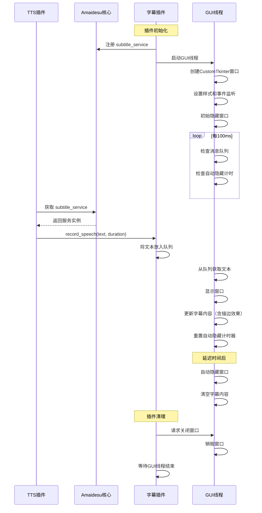

# Amaidesu 字幕插件 (Subtitle Plugin)

字幕插件是 Amaidesu VTuber 项目的一个核心组件，用于在屏幕上以字幕形式显示 AI 语音内容。本插件使用 CustomTkinter 创建一个现代化的、可拖动、始终置顶的字幕窗口，支持文字描边、半透明背景等高级功能，并专门为 OBS Studio 录制和直播场景进行了优化。

## 功能特点

- **现代化界面**: 使用 CustomTkinter 构建，外观更加现代美观
- **文字描边**: 支持可配置的文字描边效果，提高文字可读性
- **背景颜色**: 可配置的窗口背景颜色，支持透明和色度键模式
- **智能显示**: 只在有内容时显示，说完话自动隐藏
- **可拖动窗口**: 支持拖动位置（左键拖动）和右键菜单
- **高度可配置**: 字体、颜色、尺寸、行为均可自定义
- **OBS Studio 集成**: 专门优化的 OBS 友好模式，支持窗口捕获和色度键
- **任务栏管理**: 可选择在任务栏显示，便于窗口切换和管理
- **跨平台支持**: Windows、macOS 适配
- **低资源占用**: 独立线程运行，不阻塞主进程

## 依赖服务

本插件需要以下依赖：

- `customtkinter`: 现代化的 Tkinter 替代品
- `tkinter`: Python 标准库（用于 Canvas 绘制）

## 注册服务

本插件注册了以下服务，可被其他插件调用：

- `subtitle_service`: 提供字幕显示服务

## 配置选项

### 窗口样式
- `window_width`: 窗口宽度 (像素)
- `window_height`: 窗口高度 (像素)
- `window_offset_y`: 窗口底部距离屏幕底部的距离 (像素)
- `font_family`: 字体名称
- `font_size`: 字号大小
- `font_weight`: 字重 (normal, bold)
- `text_color`: 文字颜色

### 窗口行为配置
- `always_show_window`: 是否始终显示窗口（便于 OBS 窗口捕获）
- `show_in_taskbar`: 是否在任务栏显示（便于点击切换）
- `window_minimizable`: 是否允许最小化窗口
- `show_waiting_text`: 是否显示等待文字（设为 false 在无内容时透明）

### 文字描边设置
- `outline_enabled`: 是否启用文字描边
- `outline_color`: 描边颜色
- `outline_width`: 描边粗细 (像素)

### 背景设置
- `background_color`: 背景颜色（支持颜色名称和 #RRGGBB 格式）

### 行为控制
- `fade_delay_seconds`: 语音停止后多少秒开始隐藏字幕
- `auto_hide`: 是否自动隐藏字幕（话说完就隐藏）
- `window_alpha`: 整体窗口透明度 (0.0-1.0)

### OBS Studio 集成配置
- `obs_friendly_mode`: 是否启用 OBS 友好模式（优化窗口行为）
- `window_title`: 窗口标题（便于 OBS 识别和选择）
- `use_chroma_key`: 是否使用色度键背景（绿幕抠像）
- `chroma_key_color`: 色度键颜色（绿幕: #00FF00, 蓝幕: #0000FF）

## 消息处理流程

1. **初始化阶段**：
   - 加载配置文件
   - 检查 CustomTkinter 可用性
   - 初始化窗口参数

2. **设置阶段** (`setup()`)：
   - 注册 `subtitle_service` 服务
   - 启动独立 GUI 线程
   - 创建 CustomTkinter 窗口（初始隐藏）

3. **字幕显示流程**：
   - 其他插件调用 `record_speech(text, duration)`
   - 文本被放入线程安全队列
   - GUI 线程检测到新文本，显示窗口并更新内容
   - 启动自动隐藏计时器

4. **自动隐藏机制**：
   - 监控最后一次语音时间
   - 超过配置的延迟时间后自动隐藏窗口
   - 清空显示内容

5. **用户交互**：
   - 支持拖动窗口（鼠标左键）
   - 支持右键菜单（最小化、置顶切换、透明度调整、测试显示、清空内容等）
   - 窗口大小可调（如果启用了 `window_minimizable`）

6. **清理阶段**：
   - 安全关闭窗口
   - 等待线程结束

## 时序图



## 服务使用示例

其他插件（如TTS插件）可以通过以下方式调用字幕服务：

```python
# 在 TTS 或其他插件中获取和使用字幕服务
subtitle_service = self.core.get_service("subtitle_service")
if subtitle_service:
    # 显示字幕文本
    await subtitle_service.record_speech("这是要显示的文字", 3.0)
    
    # 发送空文本可以立即隐藏字幕（如果启用了自动隐藏）
    await subtitle_service.record_speech("", 0.0)
```

## 技术实现细节

### 1. 文字描边实现

使用 Tkinter Canvas 实现文字描边效果：

```python
# 绘制描边 - 在主文字周围绘制多个偏移的文字
for dx in range(-outline_width, outline_width + 1):
    for dy in range(-outline_width, outline_width + 1):
        if dx == 0 and dy == 0:
            continue
        if dx*dx + dy*dy <= outline_width*outline_width:
            canvas.create_text(x + dx, y + dy, text=text, fill=outline_color)

# 绘制主文字
canvas.create_text(x, y, text=text, fill=text_color)
```

### 2. 智能显示机制

- **按需显示**: 窗口初始隐藏，只在有内容时显示（可配置为始终显示）
- **自动隐藏**: 根据配置的延迟时间自动隐藏或清空内容
- **状态跟踪**: 使用 `is_visible` 标志跟踪窗口状态
- **背景颜色**: 直接使用配置的背景颜色，简化了UI层次

### 3. 线程安全设计

- **队列通信**: 使用 `queue.Queue` 实现线程间安全通信
- **GUI 线程隔离**: 所有 GUI 操作在专用线程中执行
- **异常处理**: 完善的异常捕获和恢复机制

## 配置示例

```toml
[subtitle_display]
enabled = true

# 窗口样式
window_width = 800
window_height = 100
window_offset_y = 100
font_family = "Microsoft YaHei UI"
font_size = 28
font_weight = "bold"
text_color = "white"

# 窗口行为配置
always_show_window = true          # 便于 OBS 窗口捕获
show_in_taskbar = true             # 便于点击切换
window_minimizable = true          # 允许最小化
show_waiting_text = false          # 无内容时透明

# 文字描边设置
outline_enabled = true
outline_color = "black"
outline_width = 2

# 背景设置
background_color = "white"         # 背景颜色

# 行为设置
fade_delay_seconds = 5
auto_hide = true
window_alpha = 0.95

# OBS 集成配置
obs_friendly_mode = true           # OBS 友好模式
window_title = "Amaidesu-Subtitle-OBS" # 便于 OBS 识别
use_chroma_key = false             # 是否使用绿幕
chroma_key_color = "#00FF00"       # 绿幕颜色
```

## OBS Studio 使用指南

### 1. 窗口捕获设置
1. 在 OBS 中添加"窗口捕获"源
2. 选择窗口：`Amaidesu-Subtitle-OBS`
3. 建议启用"捕获鼠标光标"选项（可选）

### 2. 透明叠加设置
- 设置合适的 `background_color` 实现所需的背景效果
- 调整 `window_alpha` 控制整体透明度
- 使用文字描边提高可读性

### 3. 色度键抠像设置
- 启用 `use_chroma_key = true`
- 设置 `chroma_key_color = "#00FF00"` （绿幕）
- 在 OBS 中添加"色度键"滤镜
- 选择对应的绿幕颜色进行抠像

### 4. 窗口管理
- `always_show_window = true`: 窗口持续存在，便于 OBS 捕获
- `show_in_taskbar = true`: 可在任务栏切换窗口
- 支持拖动调整位置
- 右键菜单功能：
  - **最小化/显示窗口**: 快速控制窗口显示状态
  - **置顶/取消置顶**: 切换窗口的置顶状态
  - **调整透明度**: 循环调整窗口透明度（1.0 → 0.8 → 0.6 → 0.4 → 1.0）
  - **测试显示**: 显示测试消息，用于检查 OBS 捕获效果
  - **清空内容**: 立即清空字幕内容
  - **关闭窗口**: 关闭字幕窗口

## 开发注意事项

1. **依赖检查**: 
   - 启动时检查 CustomTkinter 可用性
   - 优雅降级处理依赖缺失情况

2. **线程安全**:
   - 所有 GUI 操作必须在 GUI 线程中执行
   - 使用队列进行跨线程通信
   - 避免直接从其他线程修改 GUI 元素

3. **资源管理**:
   - 确保插件清理时正确终止线程
   - 妥善处理窗口关闭事件
   - 防止内存泄漏

4. **用户体验**:
   - 合理的默认配置
   - 流畅的显示和隐藏动画效果
   - 直观的交互方式

5. **OBS 集成优化**:
   - 窗口标题统一命名便于识别
   - 支持透明背景和色度键两种方案
   - 窗口状态持久化，避免频繁创建销毁
   - 任务栏可见性配置，便于用户管理

## 性能优化

1. **低延迟显示**: 队列检查间隔设为 100ms，保证响应速度
2. **内存优化**: 及时清理不需要的对象和引用
3. **CPU 友好**: 使用事件驱动而非高频轮询
4. **守护线程**: GUI 线程设为守护线程，确保主程序退出时自动清理

## 故障排除

### 常见问题

1. **字幕不显示**: 检查 CustomTkinter 是否正确安装
2. **字体显示异常**: 确认系统是否支持配置的字体
3. **窗口位置异常**: 检查屏幕分辨率和偏移量配置
4. **描边效果不明显**: 调整描边颜色对比度和宽度
5. **OBS 无法捕获窗口**: 确认窗口标题设置和 `always_show_window` 配置
6. **色度键抠像效果不佳**: 调整色度键颜色和 OBS 滤镜参数

### 调试方法

1. 查看插件日志输出
2. 检查配置文件格式
3. 验证依赖库版本兼容性
4. 测试不同操作系统的兼容性
5. 在 OBS 中测试不同的捕获模式

### OBS 集成问题

1. **窗口无法被 OBS 识别**:
   - 确认 `obs_friendly_mode = true`
   - 检查窗口标题是否正确设置
   - 重启 OBS 并重新添加窗口捕获源

2. **透明效果不理想**:
   - 调整 `background_color` 参数，选择合适的背景色
   - 调整 `window_alpha` 参数控制整体透明度
   - 确保文字描边足够明显

3. **色度键抠像问题**:
   - 确认色度键颜色设置正确
   - 在 OBS 中调整色度键滤镜的相似度和平滑度参数
   - 避免文字颜色与色度键颜色过于接近 